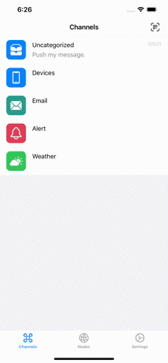

# Chanify

[](https://itunes.apple.com/app/id1531546573)
[](LICENSE)

[English](README.md) | 简体中文

Chanify是一个简单的消息推送工具。每一个人都可以利用提供的API来发送消息推送到自己的iOS设备上。

你还可以部署自己的[服务器](https://github.com/chanify/chanify)。

<details open="open">
  <summary><h2 style="display: inline-block">Table of Contents</h2></summary>
  <ol>
    <li><a href="#入门">入门</a></li>
    <li>
        <a href="#usage">用法</a>
        <ul>
            <li><a href="#http-api">HTTP API</a></li>
            <li><a href="#命令行">命令行</a></li>
            <li><a href="#python-3">Python 3</a></li>
            <li><a href="#ruby">Ruby</a></li>
            <li><a href="#nodejs">NodeJS</a></li>
        </ul>
    </li>
    <li><a href="#开发者">开发者</a></li>
    <li><a href="#贡献">贡献</a></li>
    <li><a href="#许可证">许可证</a></li>
  </ol>
</details>


## 入门

1. 从AppStore安装[iOS应用](https://itunes.apple.com/cn/app/id1531546573)（1.0.0或以上版本）。
2. 从频道详情页面来获取发送使用的令牌```token```。

    

3. 使用API来发送消息。
4. 也可以通过长按扫描二维码图标来进入创建频道，创建自定义的频道。

    

## 用法

### Http API

- __GET__ 方式
```
https://api.chanify.net/v1/sender/<token>/<message>
```

- __POST__ 方式
```
https://api.chanify.net/v1/sender/<token>
```

Content-Type: 

- ```text/plain```: Body is text message
- ```multipart/form-data```: The block of data("text") is text message
- ```application/x-www-form-urlencoded```: ```text=<url encoded text message>```

支持以下参数：

| 参数名    | 描述                               |
| -------- | --------------------------------- |
| title    | 通知消息的标题                      |
| sound    | `1` 启用声音提示, 其他情况会静音推送   |
| priority | `10` 默认优先级, 或者 `5` 较低优先级  |

例如：

```
https://api.chanify.net/v1/sender/<token>?sound=1&priority=10&title=hello
```

### 命令行

```bash
# 发送文本消息
$ curl --form-string "text=hello" "https://api.chanify.net/v1/sender/<token>"

# 发送文本文件
$ cat message.txt | curl -H "Content-Type: text/plain" --data-binary @- "https://api.chanify.net/v1/sender/<token>"
```

### Python 3

```python
from urllib import request, parse

data = parse.urlencode({ 'text': 'hello' }).encode()
req = request.Request("https://api.chanify.net/v1/sender/<token>", data=data)
request.urlopen(req)
```

### Ruby

```ruby
require 'net/http'

uri = URI('https://api.chanify.net/v1/sender/<token>')
res = Net::HTTP.post_form(uri, 'text' => 'hello')
puts res.body
```

### NodeJS

```javascript
const https = require('https')
const querystring = require('querystring');

const data = querystring.stringify({ text: 'hello' })
const options = {
    hostname: 'api.chanify.net',
    port: 443,
    path: '/v1/sender/token',
    method: 'POST',
    headers: {
        'Content-Type': 'application/x-www-form-urlencoded',
        'Content-Length': data.length
        }
    }
    var req = https.request(options, (res) => {
    res.on('data', (d) => {
        process.stdout.write(d);
    });
});  
req.write(data);
req.end();
```

## 开发者

初始化项目依赖

```bash
$ pod install
```

可以使用下列命令给模拟器发送推送用于测试

```bash
$ ./send.swift text=hello
```

## 贡献

贡献使开源社区成为了一个令人赞叹的学习，启发和创造场所。 **十分感谢**您做出的任何贡献。

1. Fork本项目
2. 创建您的Feature分支 (`git checkout -b feature/AmazingFeature`)
3. 提交您的更改 (`git commit -m 'Add some AmazingFeature'`)
4. 推送到分支 (`git push origin feature/AmazingFeature`)
5. 开启一个Pull Request

## 许可证

根据MIT许可证分发，详情查看[`LICENSE`](LICENSE)。
