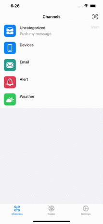

# Chanify

[](https://itunes.apple.com/app/id1531546573)
[](LICENSE)

English | [简体中文](README-zh_CN.md)

Chanify is a safe and simple notification tools. For developers, system administrators, and everyone can push notifications with API.

You can deploy your own [server](https://github.com/chanify/chanify).

<details open="open">
  <summary><h2 style="display: inline-block">Table of Contents</h2></summary>
  <ol>
    <li><a href="#getting-started">Getting Started</a></li>
    <li>
        <a href="#usage">Usage</a>
        <ul>
            <li><a href="#http-api">HTTP API</a></li>
            <li><a href="#command-line">Command Line</a></li>
            <li><a href="#python-3">Python 3</a></li>
            <li><a href="#ruby">Ruby</a></li>
            <li><a href="#nodejs">NodeJS</a></li>
        </ul>
    </li>
    <li><a href="#for-developer">For Developer</a></li>
    <li><a href="#contributing">Contributing</a></li>
    <li><a href="#license">License</a></li>
  </ol>
</details>


## Getting Started

1. Install [iOS App](https://itunes.apple.com/us/app/id1531546573).
2. Get token from channel detail
   
    

3. Send message
4. You can create your channel

    

## Usage

### Http API

- __GET__
```
https://api.chanify.net/v1/sender/<token>/<message>
```

- __POST__
```
https://api.chanify.net/v1/sender/<token>
```

Content-Type: 

- ```text/plain```: Body is text message
- ```multipart/form-data```: The block of data("text") is text message
- ```application/x-www-form-urlencoded```: ```text=<url encoded text message>```

Additional params

| Key      | Description                               |
| -------- | ----------------------------------------- |
| title    | The title for notification message.       |
| sound    | `1` enable sound, otherwise disable sound |
| priority | `10` default, or `5`                      |

E.g.

```
https://api.chanify.net/v1/sender/<token>?sound=1&priority=10&title=hello
```

### Command Line

```bash
# Send message
$ curl --form-string "text=hello" "https://api.chanify.net/v1/sender/<token>"

# Send text file
$ cat message.txt | curl -H "Content-Type: text/plain" --data-binary @- "https://api.chanify.net/v1/sender/<token>"
```

### Python 3

```python
from urllib import request, parse

data = parse.urlencode({ 'text': 'hello' }).encode()
req = request.Request("https://api.chanify.net/v1/sender/<token>", data=data)
request.urlopen(req)
```

### Ruby

```ruby
require 'net/http'

uri = URI('https://api.chanify.net/v1/sender/<token>')
res = Net::HTTP.post_form(uri, 'text' => 'hello')
puts res.body
```

### NodeJS

```javascript
const https = require('https')
const querystring = require('querystring');

const data = querystring.stringify({ text: 'hello' })
const options = {
    hostname: 'api.chanify.net',
    port: 443,
    path: '/v1/sender/token',
    method: 'POST',
    headers: {
        'Content-Type': 'application/x-www-form-urlencoded',
        'Content-Length': data.length
        }
    }
    var req = https.request(options, (res) => {
    res.on('data', (d) => {
        process.stdout.write(d);
    });
});  
req.write(data);
req.end();
```

#### PHP

```php
$curl = curl_init();

curl_setopt_array($curl, [
    CURLOPT_URL           => 'http://<address>:<port>/v1/sender/<token>',
    CURLOPT_CUSTOMREQUEST => 'POST',
    CURLOPT_POSTFIELDS    => [
        'text' => 'hello',
        // 'link' => 'https://api.chanify.net'
    ],
]);

$response = curl_exec($curl);

curl_close($curl);
echo $response;
```

## For Developer

Init project

```bash
$ pod install
```

Test push in simulator

```bash
$ ./send.swift text=hello
```

## Contributing

Contributions are what make the open source community such an amazing place to be learn, inspire, and create. Any contributions you make are **greatly appreciated**.

1. Fork the Project
2. Create your Feature Branch (`git checkout -b feature/AmazingFeature`)
3. Commit your Changes (`git commit -m 'Add some AmazingFeature'`)
4. Push to the Branch (`git push origin feature/AmazingFeature`)
5. Open a Pull Request

## License

Distributed under the MIT License. See [`LICENSE`](LICENSE) for more information.
